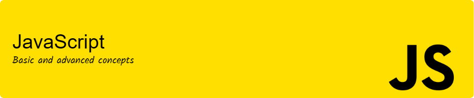

# 

Welcome to the **Complete JavaScript Guide**.

This repository contains a collection of exercises designed to reinforce and understand fundamental and advanced JavaScript concepts. Topics covered include variables, data types, arrays, objects, functions, control flow structures, classes, DOM manipulation, imports and exports, the Fetch API, and asynchronous programming. Each section includes practical examples to aid in the comprehension and proficiency of JavaScript.

## Table of Contents

1. [Requirements](#requirements)
2. [Technology Stack](#technology-stack)
3. [Features](#features)
4. [Project Structure](#project-structure)
5. [Installation](#installation)
6. [Usage](#usage)
7. [Contributing](#contributing)
8. [License](#license)
9. [Author](#author)
10. [Acknowledgements](#acknowledgements)

## Requirements

You need to have installed:

A source code editor such as [VSCode](https://code.visualstudio.com/), [Sublime Text](https://www.sublimetext.com/), or any other editor of your choice.

## Technology Stack

<div>
  
  
  
</div>

## Features

- Variables: explanation and usage of variables in JavaScript.
- Data Types: detailed information about data types.
- Arrays: working with arrays, including methods and common operations.
- Objects: understanding objects, object properties, and object methods.
- Functions: usage of functions, function declarations, function expressions, and arrow functions.
- Flow Control Structures: an overview of flow control statements like if-else, switch, for, while, and do-while loops.
- Classes: introduction to classes, class constructors, class methods, private properties, and inheritance.
- DOM Manipulation: interacting with the Document Object Model using JavaScript.
- Imports/Exports: importing and exporting modules in JavaScript.
- Fetch API: fetching data from external APIs using the Fetch API.
- Asynchronous Programming: understanding and handling asynchronous programming using callbacks, promises, async/await, and error handling.

## Project Structure

The project follows a structured directory layout:

```bash
├───📁 assets/
│   ├───📁 css/
│   ├───📁 data/
│   ├───📁 fonts/
│   ├───📁 images/
│   └───📁 js/
│       ├───📁 core/
│       │   ├───📁 arrays/
│       │   ├───📁 async/
│       │   ├───📁 classes/
│       │   ├───📁 control-flow-structures/
│       │   │   ├───📁 conditional-statements/
│       │   │   └───📁 loops/
│       │   ├───📁 data-types/
│       │   ├───📁 functions/
│       │   ├───📁 modules/
│       │   │   ├───📁 export/
│       │   │   └───📁 import/
│       │   ├───📁 objects/
│       │   ├───📁 promises/
│       │   └───📁 variables/
│       ├───📁 dom/
│       ├───📁 fetch/
│       ├───📁 utils/
│       ├───📄 hello-world.js
├───📄 dom.html
├───📄 index.html
├───📄 LICENSE
└───📄 README.md
```

## Installation

1. Clone this repository on your local machine using the following command:

```bash
git clone https://github.com/daniel-pompa/complete-javascript-guide.git
```

2. Set up a local server to view the project.

It is recommended to use the `Live Server` extension in Visual Studio Code for this purpose. Follow these steps:

- Install the Live Server extension in VSCode.
- Open the project folder in VSCode.
- Right-click on the `index.html` or `dom.html` file and select `Open with Live Server`.

## Usage

1. You have to place the script for the exercise you want to use in the `index.html` or `dom.html` file.

Examples:

```html
<!DOCTYPE html>
<html lang="en">
  <head>
    <meta charset="UTF-8" />
    <meta name="viewport" content="width=device-width, initial-scale=1.0" />
    <meta name="author" content="Daniel Pompa Pareja" />
    <meta name="description" content="JavaScript Tutorial" />
    <title>JavaScript Tutorial</title>
    <link rel="icon" href="./assets/images/javascript.svg" type="image/svg+xml" />
    <link rel="stylesheet" href="./assets/css/style.css" />
  </head>
  <body>
    <main>
      <header>
        <h1>JavaScript Tutorial</h1>
      </header>
      <section>
        <h2>Introducción</h2>
        <div class="container">
          
          <div class="social-media-container">
            <a
              href="https://github.com/daniel-pompa"
              target="_blank"
              rel="noopener noreferrer"
            >
              
            </a>
            <a
              href="https://www.linkedin.com/in/daniel-pompa"
              target="_blank"
              rel="noopener noreferrer"
            >
              
            </a>
          </div>
          <p>&copy; <span id="year"></span> Daniel Pompa Pareja</p>
        </div>
      </section>
      <!-- Quote container for displaying the quote and author -->
      <section class="quote-container"></section>
    </main>
    <script src="./assets/js/helpers/get-full-year.js"></script>
    <!-- You have to place the script here -->
  </body>
</html>
```

```html
<!DOCTYPE html>
<html lang="en">
  <head>
    <meta charset="UTF-8" />
    <meta name="viewport" content="width=device-width, initial-scale=1.0" />
    <meta name="author" content="Daniel Pompa Pareja" />
    <meta name="description" content="JavaScript Tutorial" />
    <title>JavaScript Tutorial</title>
    <link rel="icon" type="image/svg+xml" href="./assets/images/javascript.svg" />
    <link rel="stylesheet" href="./assets/css/style.css" />
  </head>
  <body>
    <main>
      <header>
        <h1 id="heading">Document Object Model (DOM)</h1>
      </header>
      <!-- Container for the DOM manipulation -->
      <section class="dom">
        <h2 class="title">Selectores</h2>
        <!-- Navigation bar -->
        <nav class="nav">
          <a class="link" href="#">Link</a>
          <a class="link" href="#">Link</a>
          <a class="link" href="#">Link</a>
          <a class="link" href="#">Link</a>
        </nav>
        <!-- Form for DOM manipulation -->
        <form id="form" novalidate>
          <input
            type="email"
            name="email"
            id="email"
            autocomplete="email"
            placeholder="Correo electrónico"
          />
          <input
            type="password"
            name="password"
            id="password"
            autocomplete="current-password"
            placeholder="Contraseña"
          />
          <input type="submit" value="Enviar" />
        </form>
        <!-- Container for dynamically generated content -->
        <div id="generated-content"></div>
      </section>
      <!-- End of container for the DOM manipulation -->
    </main>
    <!-- You have to place the script here -->
  </body>
</html>
```

2. Check the result of the selected exercise in the browser console.

Open your browser's console to verify the results of the exercise you have integrated. You can access the console by pressing `F12` or `Ctrl+Shift+I` (Cmd+Option+I on macOS) and selecting the "Console" tab.

## Contributing

Contributions are welcome! Please follow these steps:

1. Fork the repository.
2. Create a new branch (`git checkout -b feature-branch`).
3. Make your changes.
4. Commit your changes (`git commit -am 'add new feature'`).
5. Push to the branch (`git push origin feature-branch`).
6. Create a new Pull Request.

## License

[](https://choosealicense.com/licenses/mit/)

## Author

This project is maintained and developed by **Daniel Pompa Pareja**.

<div>
  <a href="https://www.linkedin.com/in/daniel-pompa" target="_blank" rel="noopener noreferrer">
    
  </a>
  <a href="mailto:daniel.40.pompa@gmail.com">
    
  </a>
</div>

If you have any questions, suggestions, or feedback, please feel free to reach out to me.

## Acknowledgements

Special thanks to the creators of the [GitHub Profile Header Generator](https://leviarista.github.io/github-profile-header-generator/), which I used to generate the header image for this README.

I would like to extend my sincere thanks to the following individuals and organizations for their contributions and support:

- **[Mozilla Developer Network (MDN)](https://developer.mozilla.org/es/docs/Web/JavaScript)**: Excellent documentation on JavaScript, from the basics to more advanced concepts.
- **[JavaScript.info](https://javascript.info/)**: A modern tutorial covering JavaScript from basics to advanced topics, including real-world examples and projects.
- **[Eloquent JavaScript](https://eloquentjavascript.net/)**: A free online book that covers many aspects of JavaScript and its effective usage.
- **[Skillicons](https://skillicons.dev/)**: For high-quality icons that enhance the visual appeal of this project.
- **Open Source Community**: For the countless resources, tutorials, and tools that have supported our learning journey.
- **Contributors**: A special thank you to all the contributors who have provided feedback, suggestions, and support throughout the development of this project.

Your contributions and support have been instrumental in the success of this project. Thank you!

Have fun and enjoy learning JavaScript! ✨

[Back to Top](#table-of-contents)
